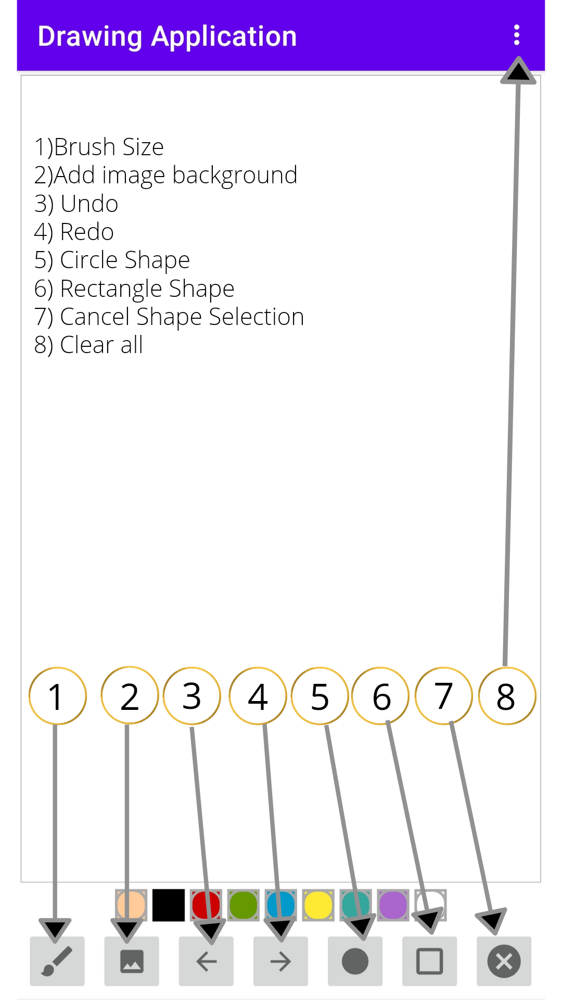

# Android DrawingApplication Kotlin
A drawing application

I used view binding, Bitmap, Canvas, Dialog, Intent, Permission, Menu...

https://user-images.githubusercontent.com/69236889/120199634-6b6dbb80-c25e-11eb-8ec0-9aff5ccdaffe.mp4

https://user-images.githubusercontent.com/69236889/120201445-690c6100-c260-11eb-8776-7e778f06206d.mp4
